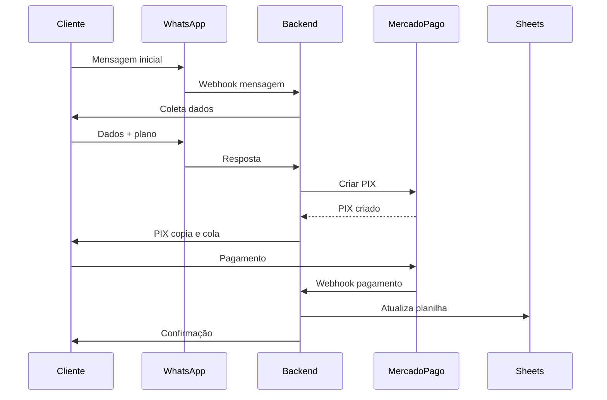
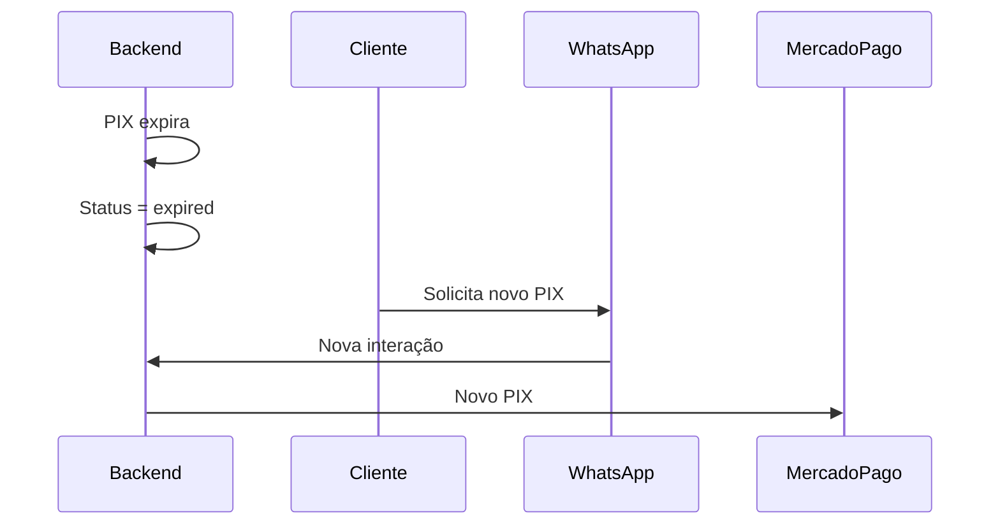

Abaixo está **um único documento consolidado**, contendo:

- PRD completo
- Divisão em **Épicos e Tasks**
- **Diagramas de sequência**
- **Contratos de API (OpenAPI)**

Documento pronto para execução técnica.

---

# PRD — Sistema de Automação e Controle de Pagamentos PIX via WhatsApp

## 1. Visão Geral

Sistema para automatizar cobranças mensais via PIX utilizando WhatsApp (API oficial da Meta), geração de PIX dinâmico pelo Mercado Pago, confirmação via webhook, persistência em banco de dados e controle operacional por Google Sheets.

---

## 2. Objetivos do Produto

- Eliminar controle manual de pagamentos
- Identificar automaticamente pagadores e inadimplentes
- Garantir rastreabilidade completa por request_id
- Centralizar operação administrativa via planilha
- Evitar problemas com PIX agendado

---

## 3. Escopo

### Incluído

- Bot WhatsApp (Meta Cloud API)
- PIX dinâmico Mercado Pago
- Webhooks de pagamento
- Banco de dados
- Google Sheets
- Logs e auditoria

### Fora do escopo

- Autenticação de usuário
- Assinatura recorrente automática
- Dashboard web administrativo

---

## 4. Regras de Negócio

- Pagamento exclusivamente mensal
- Valores fixos:

  - R$ 70 — individual
  - R$ 90 — 2 pessoas
  - R$ 100 — 4 pessoas

- Um PIX por interação
- Validade do PIX: **6 horas**
- Pagamento válido somente com status `approved`
- Um pagamento por mês por apartamento

---

## 5. Dados do Cliente

- Nome
- Telefone (WhatsApp)
- Condomínio
- Bloco
- Apartamento

---

## 6. Arquitetura Geral

- Backend: Python + FastAPI
- Bot: WhatsApp Cloud API
- Pagamento: Mercado Pago PIX
- Persistência:

  - Banco relacional (PostgreSQL ou SQLite)
  - Google Sheets (operacional)

- Infra:

  - Docker
  - HTTPS público (webhooks)

---

## 7. Identificação e Observabilidade

### Request ID

Gerado em toda requisição.

Formato:

```
req_YYYY_MM_DD_<hash>
```

Propagado para:

- Logs
- Banco
- Google Sheets
- Responses
- Webhooks processados

---

## 8. Padrão Global de Resposta

```json
{
  "request_id": "req_2025_03_08_a1b2c3",
  "success": true,
  "action": "create_pix",
  "data": {},
  "error": {
    "code": null,
    "message": null,
    "source": null
  },
  "timestamp": "ISO-8601"
}
```

---

## 9. Integração Mercado Pago

### external_reference (obrigatório)

```
PIX|YYYY-MM|VALOR|TELEFONE|APARTAMENTO
```

### Expiração

- Sempre 6 horas
- Novo PIX a cada interação

Docs:
[https://www.mercadopago.com.br/developers/pt/docs/checkout-bricks/payment-brick/payment-submission/pix](https://www.mercadopago.com.br/developers/pt/docs/checkout-bricks/payment-brick/payment-submission/pix)
[https://www.mercadopago.com.br/developers/pt/docs/notifications/webhooks](https://www.mercadopago.com.br/developers/pt/docs/notifications/webhooks)

---

## 10. Persistência de Dados

### Banco de Dados

**clients**

- id
- name
- phone
- condo
- block
- apartment
- created_at

**payments**

- id
- request_id
- client_id
- month_ref
- amount
- status
- mp_payment_id
- external_reference
- created_at
- paid_at

---

### Google Sheets

Colunas:

- request_id
- nome
- telefone
- condominio
- bloco
- apartamento
- mes
- valor
- status
- data_criacao
- data_pagamento
- mp_payment_id

Docs:
[https://developers.google.com/sheets/api](https://developers.google.com/sheets/api)

---

# 11. Épicos e Tasks

## ÉPICO 1 — Infraestrutura Base

- Criar projeto FastAPI
- Configurar Docker
- Configurar variáveis de ambiente
- Estrutura de logs
- Middleware de request_id

---

## ÉPICO 2 — Bot WhatsApp

- Integração WhatsApp Cloud API
- Endpoint webhook WhatsApp
- Parser de mensagens
- Fluxo conversacional
- Envio de mensagens template/texto

Docs:
[https://developers.facebook.com/docs/whatsapp/cloud-api](https://developers.facebook.com/docs/whatsapp/cloud-api)

---

## ÉPICO 3 — Cadastro de Cliente

- Criar cliente no banco
- Atualizar dados se já existir
- Validação de telefone
- Persistência inicial

---

## ÉPICO 4 — Geração de PIX

- Integração Mercado Pago
- Montagem do payload PIX
- Geração de external_reference
- Controle de expiração (6h)
- Persistência do pagamento como `pending`

---

## ÉPICO 5 — Webhooks Mercado Pago

- Endpoint webhook
- Validação de evento
- Busca do pagamento
- Idempotência
- Atualização de status
- Registro de pagamento confirmado

---

## ÉPICO 6 — Google Sheets

- Autenticação Google API
- Inserção de linha
- Atualização de status
- Garantia de consistência

---

## ÉPICO 7 — Notificações

- Confirmação de pagamento via WhatsApp
- Mensagem de erro
- Reemissão de PIX expirado

---

## ÉPICO 8 — Observabilidade

- Logs estruturados
- Tabela de erros
- Auditoria por request_id

---

# 12. Diagramas de Sequência

## 12.1 Fluxo Principal



---

## 12.2 Fluxo de Expiração



---

# 13. Contratos de API (OpenAPI)

## 13.1 Criar PIX

```yaml
POST /pix/create
requestBody:
  required: true
  content:
    application/json:
      schema:
        type: object
        properties:
          phone:
            type: string
          name:
            type: string
          condo:
            type: string
          block:
            type: string
          apartment:
            type: string
          plan_value:
            type: number
responses:
  200:
    description: PIX criado
```

---

## 13.2 Webhook Mercado Pago

```yaml
POST /webhooks/mercadopago
requestBody:
  required: true
responses:
  200:
    description: Evento processado
```

---

## 13.3 Webhook WhatsApp

```yaml
POST /webhooks/whatsapp
requestBody:
  required: true
responses:
  200:
    description: Mensagem processada
```

---

# 14. Critérios de Sucesso

- 100% dos pagamentos identificados automaticamente
- Zero conciliação manual
- Um PIX por interação
- Nenhum PIX reutilizado
- Auditoria completa via request_id

---

## 15. Referências Oficiais

- WhatsApp Cloud API
  [https://developers.facebook.com/docs/whatsapp/cloud-api](https://developers.facebook.com/docs/whatsapp/cloud-api)

- Mercado Pago PIX
  [https://www.mercadopago.com.br/developers/pt/docs/checkout-bricks/payment-brick/payment-submission/pix](https://www.mercadopago.com.br/developers/pt/docs/checkout-bricks/payment-brick/payment-submission/pix)

- Webhooks Mercado Pago
  [https://www.mercadopago.com.br/developers/pt/docs/notifications/webhooks](https://www.mercadopago.com.br/developers/pt/docs/notifications/webhooks)

- FastAPI
  [https://fastapi.tiangolo.com/](https://fastapi.tiangolo.com/)

- Google Sheets API
  [https://developers.google.com/sheets/api](https://developers.google.com/sheets/api)

---

Se quiser, o próximo passo lógico é:

- gerar **repositório base**
- criar **OpenAPI completo**
- desenhar **modelo ER**
- definir **mensagens padrão do bot**
